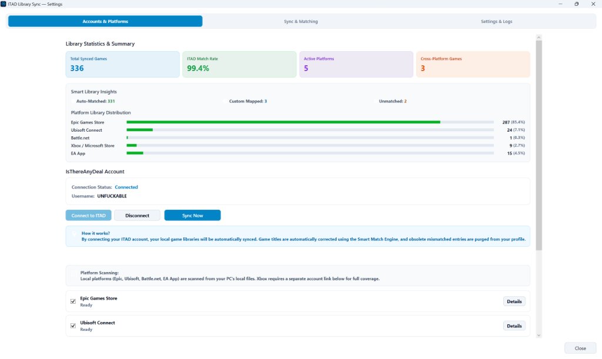
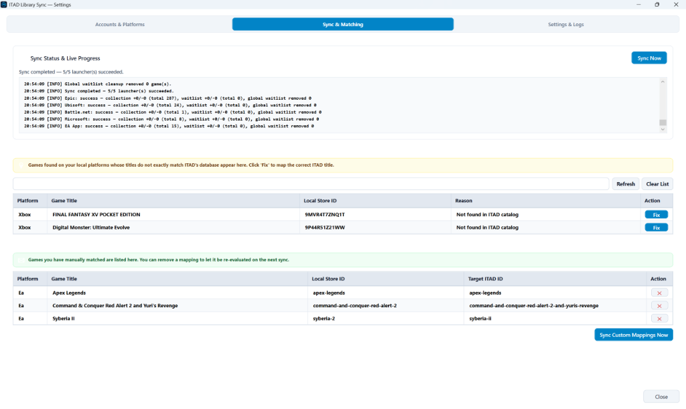
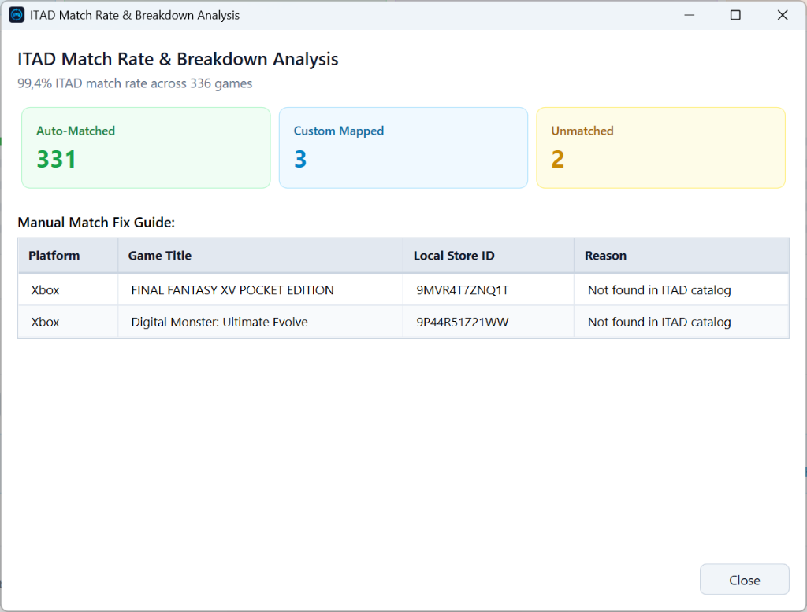

<a id="top"></a>

# ITAD Library Sync

<p align="center">
  <a href="https://www.patreon.com/16495069/join" target="_blank"></a>
  &nbsp;&nbsp;
  <a href="https://www.patreon.com/16495069/join" target="_blank"></a>
  &nbsp;&nbsp;
  <a href="#english-documentation"></a>
  &nbsp;&nbsp;
  <a href="#turkish-documentation"></a>
</p>

---

<a id="english-documentation"></a>
## 🇬🇧 ITAD Library Sync - English

[](https://github.com/Tunamaran/ITAD.LibrarySync/releases)
[](LICENSE)
[](https://github.com/Tunamaran/ITAD.LibrarySync)
[](https://dotnet.microsoft.com/)

**ITAD Library Sync** is a lightweight, modern Windows WPF system tray application that automatically synchronizes your local game libraries from **Epic Games Store, Ubisoft Connect, Battle.net, Xbox / Microsoft Store, and EA App** to your [IsThereAnyDeal](https://isthereanydeal.com/) Collection and Waitlist profiles.

---

### 📸 Application Screenshots

#### 1. Accounts & Platforms Dashboard


#### 2. Sync Progress, Unmatched Games & Custom Mappings


#### 3. Interactive Stat Breakdown Popup


---

### 🌟 Key Features

- **⚡ 100% Local & Password-Free Launcher Sync:** 
  Reads games directly from local encrypted launcher caches and Windows registries for Epic, Ubisoft, Battle.net, and EA App. No launcher login credentials required!
- **🤖 Smart Match Engine (SmartMatchEngine):**
  Automatically normalizes game titles, handles franchise prefixes (*Sid Meier's, Tom Clancy's, EA SPORTS*), formats DLC colons (*Base: DLC*), and strips regional tags so games match ITAD database IDs seamlessly.
- **📊 Interactive Summary Stat Cards & Detail Popups:**
  Click any of the 4 interactive summary cards (*Total Synced Games, ITAD Match Rate, Active Platforms, Cross-Platform Games*) to open rich, searchable breakdown popups with single-click fix match tools.
- **🔄 Inline Live Sync Progress & Real-Time Log Viewer:**
  Monitor background or manual synchronization progress in real-time via an embedded log viewer card right inside the Sync & Matching tab.
- **🧹 Automatic ITAD Obsolete Entry Purging:**
  Automatically identifies and deletes obsolete or mis-matched game IDs from your ITAD Waitlist/Collection right after a successful sync.
- **🔍 Multi-Drive Deep Scanner:**
  Scans all fixed drives (`C:`, `D:`, `E:`, `F:`) to discover games installed across custom directories.
- **📊 Searchable Library Preview & Diagnostic Info:**
  Inspect your full game list, store IDs, detected folder paths (`📌 Resolved Path`), and detection methods (`🔍 Detection Source`) before running a sync.
- **🧩 Unmatched Games & Custom Mappings Manager:**
  Review games not automatically matched in ITAD's catalog, paste an ITAD page URL (e.g., `https://isthereanydeal.com/game/syberia-ii/info/`) or slug to create custom mappings, view/delete saved rules, and trigger dedicated single-click syncs for custom mapped games!
- **❤️ Integrated Patreon Support:**
  Quick access to support project development on Patreon directly from the **Settings & Logs** tab.
- **🌐 Dual Language Support (English & Türkçe):**
  Full English interface by default, with dynamic runtime switching to Turkish in Settings.
- **⏰ Automatic & Tray Background Synchronization:**
  Runs silently in the system tray with customizable auto-sync intervals (6h, 12h, 24h, weekly) or manual one-click sync.
- **☁️ Cloud Save Backup (OneDrive / Google Drive / Dropbox):**
  Pick the games installed on your PC and move their save folders into your cloud folder with one click. The game keeps saving to the same path while your files are uploaded and stay safe — and you can undo everything anytime.
- **🔎 Live Save-Folder Lookup (PCGamingWiki):**
  When a game's save folder is unknown, the app can look it up live on PCGamingWiki (optional, cached) — Steam support included.

---

### 🎮 Supported Platform Launcher Matrix

| Platform Launcher | Local Sync Method | Credentials Required? | Wishlist Sync |
| :--- | :--- | :---: | :---: |
| **Epic Games Store** | Local Manifests + Multi-Drive Scan | ❌ No | ✅ Best-effort (Local Cache) |
| **Ubisoft Connect** | Encrypted `configurations` Cache + Registry | ❌ No | ➖ N/A |
| **Battle.net** | Local Product Database Scan | ❌ No | ➖ N/A |
| **EA App** | Local Encrypted `IS` Cache Scan | ❌ No | ➖ N/A |
| **Xbox / Microsoft Store** | Installed Apps + Xbox Live OAuth Play History | 🔑 Xbox Sign-In | ➖ N/A |

---

### 🚀 Installation & Getting Started

1. **Download the App:**
   - Download `ITAD.LibrarySync-Setup-vX.X.X.exe` (Installer) or `ITAD.LibrarySync-win-x64.zip` (Portable) from [GitHub Releases](https://github.com/Tunamaran/ITAD.LibrarySync/releases).
2. **First-Run Setup:**
   - Launch the application and click **"Connect to ITAD"** to sign in via the secure web login (OAuth2 PKCE).
3. **Verify Detected Libraries:**
   - Go to **Settings → Platforms** and click **Test** or **Details** next to any launcher to preview detected games.
4. **Sync Your Library:**
   - Click **"Sync Now"** in Settings or right-click the System Tray icon and select **"Sync Now"**.

---

### ⚙️ How EA App & Xbox Sync Work

- **EA App:** 
  Works 100% locally from EA's encrypted `IS` cache file on your PC. You do not need to sign in to EA inside the app. If decryption fails, simply open and launch EA App once while online so EA can refresh its local cache key.
- **Xbox / Microsoft Store:**
  Combines PC local app manifest scanning with Xbox Live Title History. Connect your Xbox account under **Settings → Platforms → Xbox Connect** for full coverage including Xbox Game Pass games.

---

### ☁️ Cloud Save Backup (Settings → Cloud Saves)

Backs up game save folders to your personal cloud so they survive re-installs or a formatted PC:

1. **Choose your cloud folder** — the app detects OneDrive, Google Drive and Dropbox automatically, including drive-letter mounts and localized folder names (e.g. `Drive'ım`).
2. **Pick the games to back up** — only games *installed* on this PC are listed (Epic, Ubisoft, Battle.net, EA App, Xbox and **Steam**). Save folders come from the built-in database or a live PCGamingWiki lookup (optional, cached for 30 days).
3. **Move to cloud** — the selected saves are copied into `<cloud>\ITAD_GameSaves\...` and each original folder is replaced by an NTFS junction, so games keep saving to the same path while your cloud client uploads the files. No admin rights are needed, and everything can be restored from the same tab.

> **Steam is supported only for Cloud Saves** — it is not part of the ITAD library sync.

---

### 🛠️ Building From Source

Prerequisites:
- **Windows 10/11 x64**
- **.NET 8.0 SDK**

```powershell
# Clone the repository
git clone https://github.com/Tunamaran/ITAD.LibrarySync.git
cd ITAD.LibrarySync

# Build the project
dotnet build

# Run the app locally
dotnet run --project src/ITAD.LibrarySync.App

# Publish a self-contained release binary
dotnet publish src/ITAD.LibrarySync.App -c Release -r win-x64 --self-contained true -p:PublishSingleFile=true
```

<p align="right">
  <a href="#top"><b>⬆ Back to Top</b></a> &nbsp;|&nbsp; 
  <a href="#turkish-documentation"><b>🇹🇷 Switch to Türkçe</b></a>
</p>

---

<br/>

<a id="turkish-documentation"></a>
## 🇹🇷 ITAD Library Sync - Türkçe

**ITAD Library Sync**, **Epic Games Store, Ubisoft Connect, Battle.net, Xbox / Microsoft Store ve EA App** kütüphanelerinizdeki oyunları yerel olarak tarayıp [IsThereAnyDeal](https://isthereanydeal.com/) (ITAD) Koleksiyon ve İstek Listesi (Waitlist) profillerinize otomatik aktaran hafif, modern bir Windows WPF sistem tepsisi (system tray) uygulamasıdır.

---

### 📸 Uygulama İçi Ekran Görüntüleri

#### 1. Hesaplar & Platformlar Paneli


#### 2. Canlı İlerleme, Eşleşmeyenler & Özel Eşleşme Kuralları


#### 3. Detaylı İstatistik Analiz Penceresi


---

### 🌟 Öne Çıkan Özellikler

- **⚡ %100 Yerel ve Şifresiz Platform Taraması:**
  Epic Games, Ubisoft Connect, Battle.net ve EA App kütüphanelerinizi bilgisayarınızdaki şifreli kütüphane dosyalarından ve sistem kayıt defterinden okur. Hiçbir platform kullanıcı adı/şifresi saklanmaz!
- **🤖 Akıllı Eşleştirme Motoru (SmartMatchEngine):**
  Oyun isimlerini otomatik temizler, seri ön eklerini (*Sid Meier's, Tom Clancy's, EA SPORTS*) düzenler, DLC iki nokta üst üste biçimlendirmelerini (*Ana Oyun: DLC*) yapar ve ITAD veritabanı ID'leri ile kusursuz eşleştirir.
- **📊 Etkileşimli İstatistik Kartları ve Açılır Detay Pencereleri:**
  4 temel istatistik kartına (*Toplam Oyun, Eşleşme Oranı, Aktif Platformlar, Çapraz Oyunlar*) tıklayarak aranabilir detay pencerelerini açabilir, tek tıkla eşleştirme düzeltebilirsiniz.
- **🔄 Kart İçi Canlı Senkronizasyon İlerlemesi ve Log Ekranı:**
  Senkronizasyon & Eşleşmeler sekmesi içerisine entegre canlı log ekranı ve ilerleme çubuğu ile eşzamanlı aktarım durumunu takip edin.
- **🧹 Otomatik ITAD Hatalı Kayıt Temizliği (Auto-Purge):**
  Başarılı bir senkronizasyonun ardından, ITAD hesabınızda bulunan eski veya yanlış eşleşmiş oyun ID'lerini tespit ederek ITAD profillerinizden otomatik olarak siler.
- **🔍 Tüm Sürücüleri Derinlemesine Tarama (Multi-Drive Scan):**
  `C:`, `D:`, `E:`, `F:` gibi tüm sabit disklerinizi tarayarak farklı sürücülere kurulu oyunlarınızı eksiksiz tespit eder.
- **📊 Aranabilir Kütüphane Önizlemesi ve Tanılama Kartı:**
  Senkronize etmeden önce tüm oyun listenizi, mağaza ID'lerini, tespit edilen klasör yolunu (`📌 Tespit Edilen Yol`) ve tarama metodunu (`🔍 Tespit Metodu`) detaylarıyla inceleyin.
- **🧩 Eşleşmeyen Oyun Yönetimi & Özel Eşleştirme Kuralları (Custom Mappings):**
  ITAD kataloğunda otomatik bulunamayan oyunları inceleyin, doğrudan ITAD web adresi (`https://isthereanydeal.com/game/syberia-ii/info/`) veya oyun slug'ı girerek eşleştirin, kurallarınızı yönetin ve sadece özel eşleştirilmiş oyunlarınızı tek tıkla ITAD'a aktarın!
- **❤️ Entegre Patreon Desteği:**
  **Ayarlar & Günlükler** sekmesindeki özel kart üzerinden projenin geliştirilmesine Patreon ile kolayca destek olabilirsiniz.
- **🌐 Çift Dil Desteği (İngilizce & Türkçe):**
  Varsayılan İngilizce arayüz, Ayarlar sekmesinden tek tıkla anında Türkçe yapılabilir.
- **⏰ Arka Planda Otomatik Senkronizasyon:**
  Sistem tepsisinde (tray) sessizce çalışır; belirlediğiniz zaman aralıklarında (6 saat, 12 saat, 24 saat, haftalık) kütüphanelerinizi güncel tutar.
- **☁️ Bulut Kayıt Yedeği (OneDrive / Google Drive / Dropbox):**
  Bilgisayarınıza kurulu oyunları seçin, kayıt klasörleri tek tıkla bulut klasörünüze taşınsın. Oyun aynı yere kaydetmeye devam ederken dosyalarınız bulutta güvende kalır — istediğiniz an geri alabilirsiniz.
- **🔎 Canlı Kayıt Klasörü Bulma (PCGamingWiki):**
  Oyunun kayıt klasörü bilinmiyorsa uygulama PCGamingWiki'den canlı arayabilir (isteğe bağlı, önbellekli) — Steam desteği dahil.

---

### 🎮 Desteklenen Platform Matrisi

| Platform İstemcisi | Yerel Tarama Metodu | Şifre / Giriş Gerekli mi? | İstek Listesi |
| :--- | :--- | :---: | :---: |
| **Epic Games Store** | Yerel Manifestler + Çoklu Sürücü Taraması | ❌ Hayır | ✅ Desteklenir (Yerel Önbelek) |
| **Ubisoft Connect** | Şifreli `configurations` Önbelleği + Registry | ❌ Hayır | ➖ N/A |
| **Battle.net** | Yerel Ürün Veritabanı Taraması | ❌ Hayır | ➖ N/A |
| **EA App** | Yerel Şifreli `IS` Önbellek Taraması | ❌ Hayır | ➖ N/A |
| **Xbox / Microsoft Store** | Kurulu Uygulamalar + Xbox Live Oynama Geçmişi | 🔑 Xbox Girişi | ➖ N/A |

---

### 🚀 Kurulum ve Kullanım

1. **Uygulamayı İndirin:**
   - [GitHub Releases](https://github.com/Tunamaran/ITAD.LibrarySync/releases) sayfasından `ITAD.LibrarySync-Setup-vX.X.X.exe` (Kurulum dosyası) veya `ITAD.LibrarySync-win-x64.zip` (Portatif) sürümünü indirin.
2. **İlk Kurulum Sihirbazı:**
   - Uygulamayı çalıştırın ve **"ITAD'a Bağlan"** butonuna basarak güvenli web tarayıcı penceresinden (OAuth2 PKCE) IsThereAnyDeal hesabınızla giriş yapın.
3. **Tespit Edilen Oyunları İnceleyin:**
   - **Ayarlar → Platformlar** sekmesinden istediğiniz platformun yanındaki **Test Et** veya **Detaylar** butonuna basarak okunan oyunları kontrol edin.
4. **Senkronize Edin:**
   - Ayarlar penceresinden **"Şimdi Senkronize Et"** butonuna basın veya sağ alttaki sistem tepsisi simgesine sağ tıklayıp **"Şimdi Senkronize Et"** seçeneğini seçin.

---

### ☁️ Bulut Kayıt Yedeği (Ayarlar → Bulut Kayıtları)

Oyun kayıt dosyalarınızı kişisel bulutunuza yedekler; yeniden kurulum veya format sonrasında kayıtlarınız güvende kalır:

1. **Bulut klasörünüzü seçin** — uygulama OneDrive, Google Drive ve Dropbox'ı otomatik algılar; sürücü harfi bağlantıları ve yerelleştirilmiş klasör adları (`Drive'ım` gibi) dahil.
2. **Yedeklenecek oyunları seçin** — yalnızca bu bilgisayara *kurulu* oyunlar listelenir (Epic, Ubisoft, Battle.net, EA App, Xbox ve **Steam**). Kayıt klasörleri yerleşik veritabanından veya isteğe bağlı PCGamingWiki canlı aramasından gelir (30 gün önbellekli).
3. **Buluta taşıyın** — seçilen kayıtlar `<bulut>\ITAD_GameSaves\...` klasörüne kopyalanır ve her orijinal klasör bir NTFS bağlantısı (junction) ile değiştirilir; oyunlar aynı yere kaydetmeye devam ederken dosyalarınız bulut istemciniz tarafından yüklenir. Yönetici yetkisi gerekmez ve her şey aynı sekmeden geri alınabilir.

> **Steam yalnızca Bulut Kayıtları için desteklenir** — ITAD kütüphane senkronunun bir parçası değildir.

---

### 📜 Lisans

Bu proje **MIT Lisansı** altında lisanslanmıştır — detaylar için [LICENSE](LICENSE) dosyasına bakabilirsiniz.

---

<p align="right">
  <a href="#top"><b>⬆ Başa Dön / Back to Top</b></a> &nbsp;|&nbsp; 
  <a href="#english-documentation"><b>🇬🇧 English Version</b></a>
</p>
